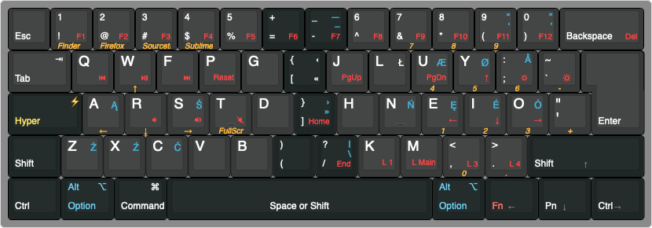

# MR Hyper Apps
Custom Karabiner setup

####  Create Hyper `⚡︎` mod key (`⌘` + `⌥` + `⌃` + `⇧`)

## Apps

| `⚡︎`| Open  | 
| ------ | ---------- |
| `⚡︎ 1`   | Finder |
|`⚡︎ 2`  | Firefox  |
| `⚡︎ 3`   | Sourcetree | 
| `⚡︎ 4`  | Sublime Text |
| `⚡︎ 5`   | Transmit | 

## Arrows

| `⚡︎`|   | 
| ------ | ---------- |
| `⚡︎ w`   | Up arrow |
|`⚡︎ s`  | Down arrow  |
| `⚡︎ a`   | Left arrow | 
| `⚡︎ d`  | Right arrow |

## Together with Spectacle

| `⚡︎`| Window Management  | Comment  |
| ------ | ---------- | ------------ |
| `⚡︎ T`   | Full screen |  `⚡︎ F` on QWERTY|
|`⚡︎ ←`  | Left half  |  |
| `⚡︎ →`   | Right half |  |
| `⚡︎ ↓`  | Lower half |  |
| `⚡︎ ↑`   | Upper half |   |

## Polish and Norwegian

Polish layout as expected (`⌥` + letters).
Norwegian a bit different:

| `⚡︎`| Letter  | 
| ------ | ---------- |
| `⚡︎ u`   | æ |
|`⚡︎ y`  | ø |
| `⚡︎ ;`   | å | 
| `⚡︎ i`  | é |

## Pok3r proggraming

Move arrows keys so I can use them with thumb on `FN`.

|QWERTY|Arrows |
| ------ | ---------- | 
|`L`|`←`|
|`P`|`↑`|
|`; :`|`↓`|
|`' "`|`→`|

Move `⌘` to it's mac's place (on left). Remember to move `FN + ⌘`.

Move `⌥` to it's mac's place. Add second `⌥` on the right instead of  `⌘`. It makes writing in other languages much easier.

`Left ⌥` + `Right ⌥` + `Spacebar`: The bottom right corner as arrow keys. (It is built in Pok3r.)

