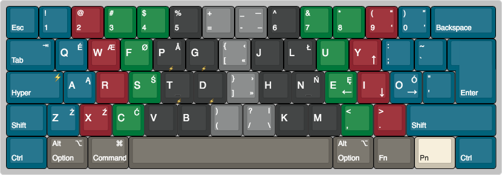

# MR Hyper Apps
Custom Karabiner setup

####  Create Hyper `⚡︎` mod key (`⌘` + `⌥` + `⌃` + `⇧`)

## Apps

| `⚡︎`| Open  | Comment  |
| ------ | ---------- | ------------ |
|`⚡︎ B`  | Firefox  | `B` is for browser   |
| `⚡︎ S`  | Sublime Text |  |
| `⚡︎ G`   | Sourcetree | `G` is for git  |
| `⚡︎ T`   | Transmit |  |
| `⚡︎ E`   | Finder |  |

## Together with Spectacle

| `⚡︎`| Window Management  | Comment  |
| ------ | ---------- | ------------ |
| `⚡︎ F`   | Full screen |   |
|`⚡︎ ←`  | Left half  |  |
| `⚡︎ →`   | Right half |  |
| `⚡︎ ↓`  | Lower half |  |
| `⚡︎ ↑`   | Upper half |   |
| `⚡︎ 3`   | Next third |   |

## Polish and Norwegian

Custom PolnormarkWide layout.

## Pok3r proggraming

Move arrows keys so I can use them with thumb on `FN`.

|Normal keys|Arrows |
| ------ | ---------- | 
|`L`|`←`|
|`P`|`↑`|
|`; :`|`↓`|
|`' "`|`→`|

Move `⌘` to it's mac's place (on left). Remember to move `FN + ⌘` as well and both sides of the keyboard.

Move `⌥` to it's place. Add second `⌥` on the right instead of  `⌘`. It makes writing in other languages much easier.